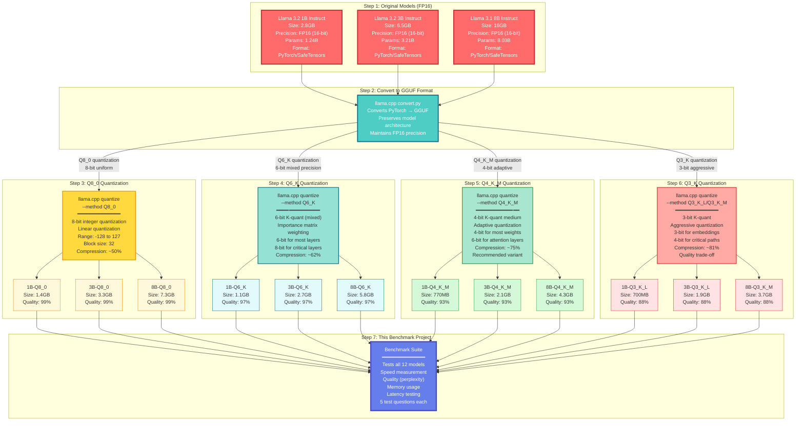
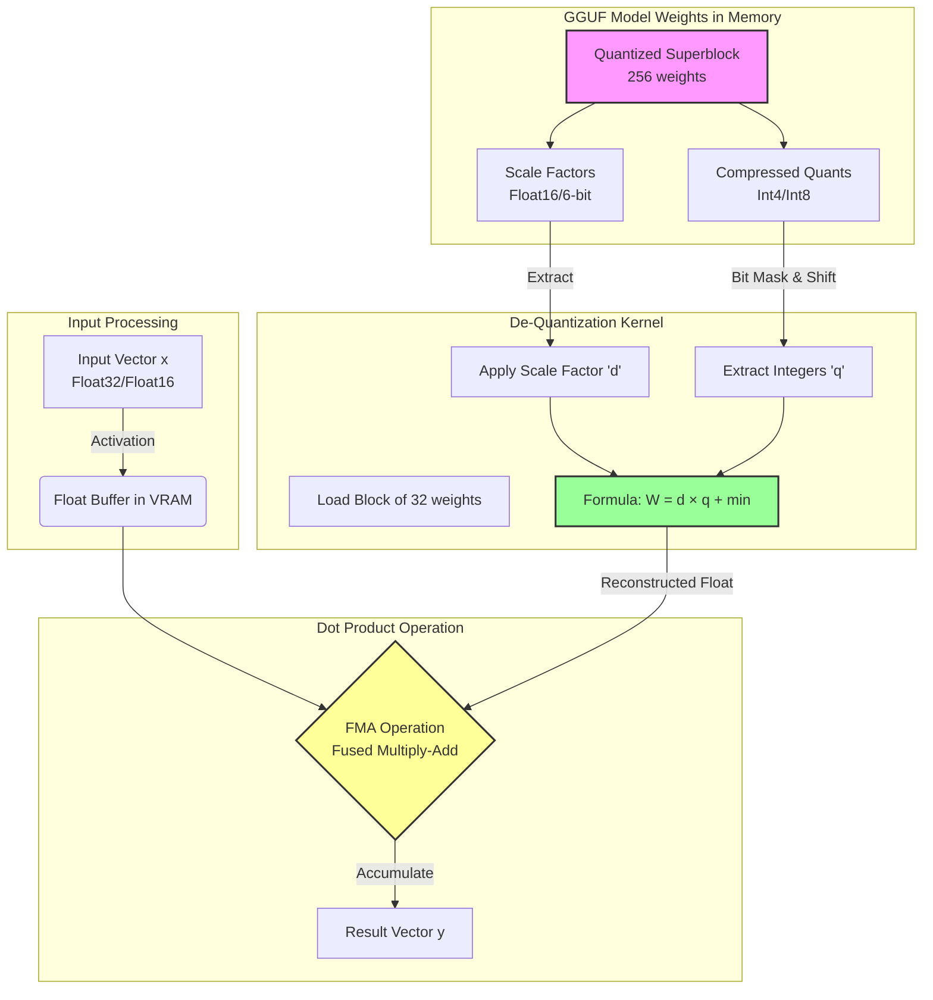
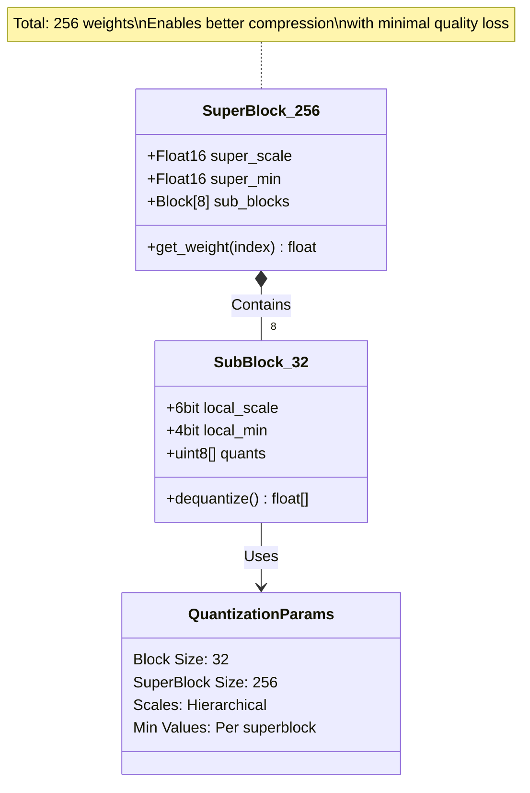
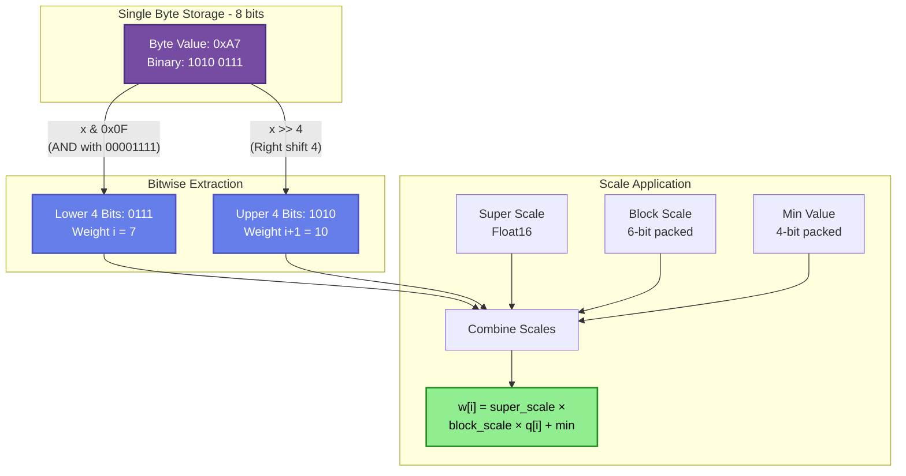
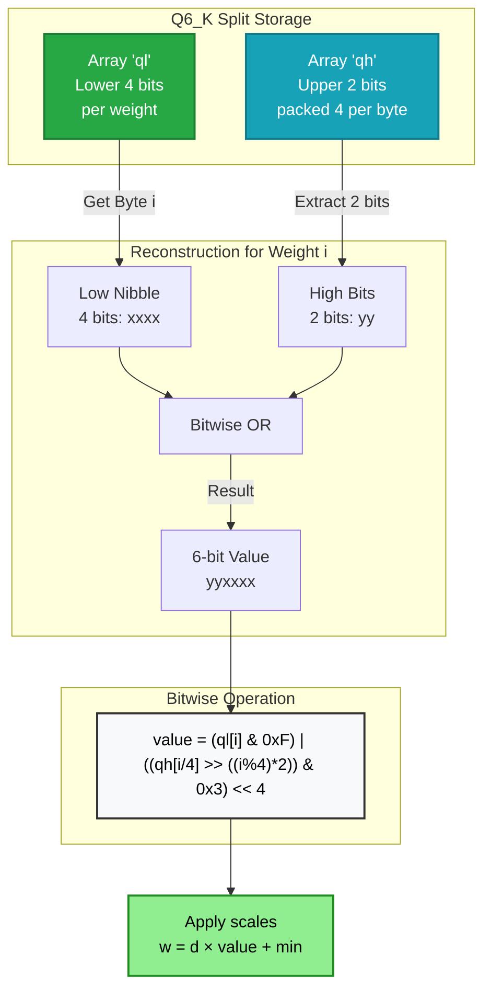
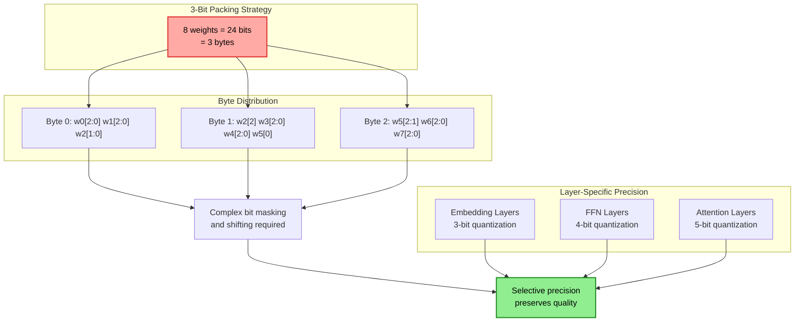
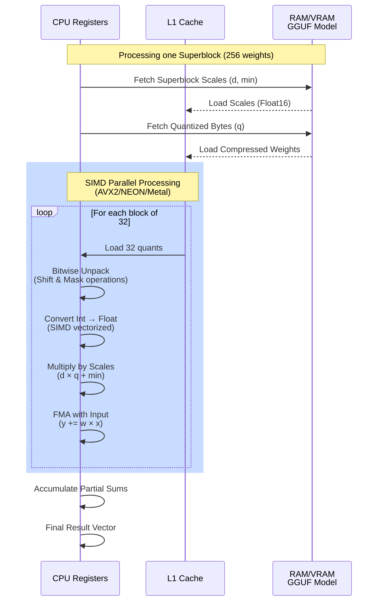
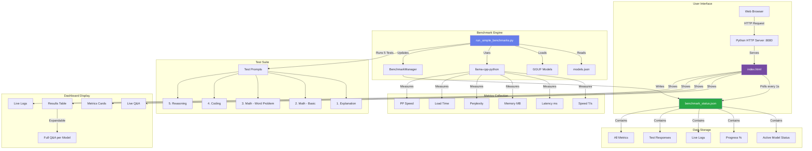
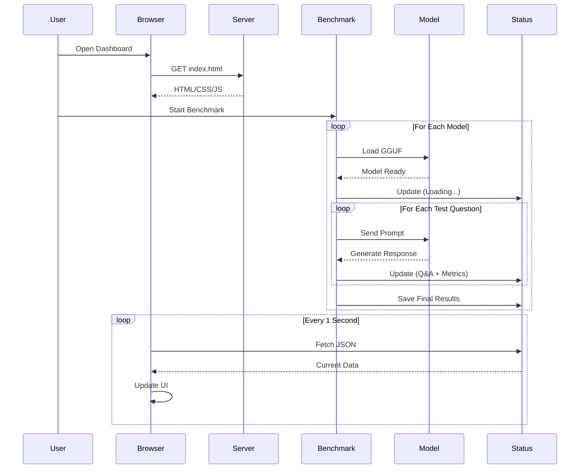

# LLM Benchmark System - Technical Documentation

## Overview

This project benchmarks GGUF-quantized LLM models across multiple dimensions: speed, quality, memory usage, and latency. It features a real-time web dashboard that displays live model responses and comprehensive metrics.

## Quantization Methods Explained

### What is Quantization?

Quantization reduces model size by representing weights with fewer bits, trading some accuracy for significant memory and speed improvements.

### Quantization Types in This Project

#### **Q8_0 (8-bit Quantization)**
- **Precision**: 8 bits per weight
- **Size**: ~50% of original FP16 model
- **Quality**: Minimal quality loss (~1-2%)
- **Speed**: Moderate
- **Use Case**: Best quality-to-size ratio for production
- **Models**: 
  - Llama-3.2-1B-Instruct-Q8_0
  - Llama-3.2-3B-Instruct-Q8_0
  - Meta-Llama-3.1-8B-Instruct-Q8_0

#### **Q6_K (6-bit K-Quant)**
- **Precision**: 6 bits per weight (mixed precision)
- **Size**: ~38% of original
- **Quality**: Slight quality loss (~2-3%)
- **Speed**: Faster than Q8
- **Use Case**: Good balance for resource-constrained environments
- **Models**:
  - Llama-3.2-1B-Instruct-Q6_K
  - Llama-3.2-3B-Instruct-Q6_K
  - Meta-Llama-3.1-8B-Instruct-Q6_K

#### **Q4_K_M (4-bit K-Quant Medium)**
- **Precision**: 4 bits per weight (mixed precision)
- **Size**: ~25% of original
- **Quality**: Noticeable but acceptable quality loss (~5-7%)
- **Speed**: Very fast
- **Use Case**: **Recommended for most users** - best speed/quality balance
- **Models**:
  - Llama-3.2-1B-Instruct-Q4_K_M
  - Llama-3.2-3B-Instruct-Q4_K_M
  - Meta-Llama-3.1-8B-Instruct-Q4_K_M

#### **Q3_K_L / Q3_K_M (3-bit K-Quant)**
- **Precision**: 3 bits per weight (mixed precision)
- **Size**: ~19% of original
- **Quality**: More quality loss (~8-12%)
- **Speed**: Fastest
- **Use Case**: Maximum speed, acceptable for simple tasks
- **Models**:
  - Llama-3.2-1B-Instruct-Q3_K_L
  - Llama-3.2-3B-Instruct-Q3_K_L
  - Meta-Llama-3.1-8B-Instruct-Q3_K_M

### K-Quant Variants

- **K_S (Small)**: Aggressive quantization, smallest size
- **K_M (Medium)**: Balanced approach
- **K_L (Large)**: More bits for important layers

## Model Quantization Pipeline

This diagram shows the detailed quantization process for each model, including the specific techniques and parameters used:



### Detailed Quantization Techniques

#### **Q8_0 - 8-bit Quantization**
- **Method**: Linear quantization with uniform scaling
- **Process**: 
  1. Calculate min/max values for each weight block (32 weights)
  2. Map FP16 values to 8-bit integers (-128 to 127)
  3. Store scale factor per block
- **Precision**: 256 discrete values per weight
- **Quality Loss**: ~1% (imperceptible)
- **Use Case**: Production deployments requiring high quality

#### **Q6_K - 6-bit K-Quant**
- **Method**: Mixed-precision with importance weighting
- **Process**:
  1. Analyze layer importance using calibration data
  2. Apply 6-bit quantization to standard layers
  3. Keep 8-bit precision for attention mechanisms
  4. Use super-blocks (256 weights) for better compression
- **Precision**: 64 discrete values (6-bit) + 256 (8-bit) for critical layers
- **Quality Loss**: ~2-3%
- **Use Case**: Balanced performance for resource-constrained systems

#### **Q4_K_M - 4-bit K-Quant Medium**
- **Method**: Adaptive quantization with layer-specific precision
- **Process**:
  1. Group weights into super-blocks (256 weights)
  2. Apply 4-bit quantization to embeddings and FFN layers
  3. Use 6-bit for attention query/key/value matrices
  4. Optimize scale factors per super-block
- **Precision**: 16 discrete values (4-bit) + 64 (6-bit) for attention
- **Quality Loss**: ~5-7%
- **Use Case**: **Recommended** - best speed/quality trade-off

#### **Q3_K_L/M - 3-bit K-Quant**
- **Method**: Aggressive quantization with selective precision
- **Process**:
  1. Use 3-bit for embedding layers (least sensitive)
  2. Apply 4-bit to feed-forward networks
  3. Maintain 5-bit for attention layers
  4. Large super-blocks (256 weights) for better accuracy
- **Precision**: 8 discrete values (3-bit) + higher for critical paths
- **Quality Loss**: ~8-12%
- **Use Case**: Maximum speed, acceptable for simple tasks

### Quantization Command Examples

```bash
# Convert original model to GGUF
python convert.py models/Llama-3.2-1B-Instruct

# Q8_0 quantization
./quantize models/Llama-3.2-1B-Instruct-f16.gguf \
           models/Llama-3.2-1B-Instruct-Q8_0.gguf Q8_0

# Q6_K quantization  
./quantize models/Llama-3.2-1B-Instruct-f16.gguf \
           models/Llama-3.2-1B-Instruct-Q6_K.gguf Q6_K

# Q4_K_M quantization (recommended)
./quantize models/Llama-3.2-1B-Instruct-f16.gguf \
           models/Llama-3.2-1B-Instruct-Q4_K_M.gguf Q4_K_M

# Q3_K_L quantization
./quantize models/Llama-3.2-1B-Instruct-f16.gguf \
           models/Llama-3.2-1B-Instruct-Q3_K_L.gguf Q3_K_L
```

### Size Comparison Table

| Model | Original (FP16) | Q8_0 | Q6_K | Q4_K_M | Q3_K |
|-------|----------------|------|------|--------|------|
| **1B** | 2.8 GB | 1.4 GB (50%) | 1.1 GB (39%) | 770 MB (27%) | 700 MB (25%) |
| **3B** | 6.5 GB | 3.3 GB (51%) | 2.7 GB (42%) | 2.1 GB (32%) | 1.9 GB (29%) |
| **8B** | 16 GB | 7.3 GB (46%) | 5.8 GB (36%) | 4.3 GB (27%) | 3.7 GB (23%) |

**Key Insights:**
- Q4_K_M provides 4x compression with minimal quality loss
- Q3_K achieves 4-5x compression but with noticeable quality impact
- Larger models benefit more from quantization (better compression ratios)
- K-quant methods intelligently preserve quality in critical layers

## Detailed Quantization Algorithms & Bit-Level Operations

This section explains the exact mathematical operations and bit manipulations used in each quantization method.

### 1. General Inference Flow: Quantized Matrix Multiplication

This diagram shows how input prompts (Float32/16) are multiplied against compressed model weights (Int4/8) during inference:



### 2. Q8_0 Algorithm (8-Bit Quantization)

Used in: `Llama-3.2-1B-Instruct-Q8_0`, `Llama-3.2-3B-Instruct-Q8_0`, `Meta-Llama-3.1-8B-Instruct-Q8_0`

**Block Structure**: 32 weights per block

```mermaid
graph LR
    subgraph "Q8_0 Memory Block Layout"
        A["Scale Delta<br/>2 bytes<br/>Float16"]
        B["Weight 0<br/>1 byte<br/>Int8"]
        C["Weight 1<br/>1 byte<br/>Int8"]
        D["...<br/>30 more<br/>Int8"]
        E["Weight 31<br/>1 byte<br/>Int8"]
    end

    subgraph "Bit Interpretation"
        A -->|Read as Float16| F["Scale Factor 'd'<br/>Range: ±65504"]
        B -->|Read as Int8| G["Quantized Value 'q0'<br/>Range: -128 to 127"]
        C -->|Read as Int8| H["Quantized Value 'q1'<br/>Range: -128 to 127"]
    end

    subgraph "Reconstruction Formula"
        F --> I["w[i] = d × q[i]"]
        G --> I
        H --> I
        I --> J["Original Weight<br/>Approximation"]
    end

    style A fill:#ff9900,color:black,stroke:#cc7700,stroke-width:2px
    style B fill:#66ccff,color:black,stroke:#3399cc,stroke-width:2px
    style C fill:#66ccff,color:black,stroke:#3399cc,stroke-width:2px
    style D fill:#66ccff,color:black,stroke:#3399cc,stroke-width:2px
    style E fill:#66ccff,color:black,stroke:#3399cc,stroke-width:2px
    style I fill:#90ee90,color:black,stroke:#228b22,stroke-width:2px
```



**Mathematical Process:**
1. **Quantization** (during model creation):
   ```
   For each block of 32 weights:
   d = max(abs(weights)) / 127
   q[i] = round(weights[i] / d)
   ```

2. **De-quantization** (during inference):
   ```
   weights[i] = d × q[i]
   ```

### 3. K-Quants Superblock Architecture

Used in: Q4_K_M, Q6_K, Q3_K models

**Key Innovation**: Hierarchical scaling with superblocks of 256 weights (8 blocks of 32)



### 4. Q4_K_M Algorithm (4-Bit Medium) - RECOMMENDED

Used in: `Llama-3.2-1B-Instruct-Q4_K_M`, `Llama-3.2-3B-Instruct-Q4_K_M`, `Meta-Llama-3.1-8B-Instruct-Q4_K_M`

**Bit Packing**: 2 weights per byte (4 bits each)



**Memory Layout for Q4_K_M Superblock (256 weights)**:
- Super scale: 2 bytes (Float16)
- Super min: 2 bytes (Float16)
- 8 block scales: 6 bits each = 6 bytes
- 8 block mins: 4 bits each = 4 bytes
- 256 weights: 4 bits each = 128 bytes
- **Total: ~142 bytes** (vs 512 bytes for FP16)

### 5. Q6_K Algorithm (6-Bit Quantization)

Used in: `Llama-3.2-1B-Instruct-Q6_K`, `Llama-3.2-3B-Instruct-Q6_K`, `Meta-Llama-3.1-8B-Instruct-Q6_K`

**Challenge**: 6 bits don't fit cleanly into 8-bit bytes
**Solution**: Split storage - 4 lower bits + 2 upper bits



**Bit Extraction Example**:
```
Byte in ql: 0b00001101 (13)
Byte in qh: 0b11001001
For weight 0: Extract bits 0-1 from qh → 01
Result: 0b010000 | 0b001101 = 0b011101 (29)
```

### 6. Q3_K Algorithm (3-Bit Quantization)

Used in: `Llama-3.2-1B-Instruct-Q3_K_L`, `Llama-3.2-3B-Instruct-Q3_K_L`, `Meta-Llama-3.1-8B-Instruct-Q3_K_M`

**Most Aggressive**: 3 bits per weight, with selective precision for critical layers



### 7. Inference Pipeline: CPU/GPU Processing

This sequence shows how quantized weights are processed during actual inference:



### Performance Characteristics

| Method | Bits/Weight | Dequant Ops/Weight | SIMD Efficiency | Memory Bandwidth |
|--------|-------------|-------------------|-----------------|------------------|
| **Q8_0** | 8 | 1 multiply | Excellent | High |
| **Q6_K** | 6 | 2 shifts + 1 OR + 1 multiply | Good | Medium |
| **Q4_K_M** | 4 | 1 shift + 1 AND + 2 multiplies | Very Good | Low |
| **Q3_K** | 3 | 3 shifts + 2 ANDs + 2 multiplies | Good | Very Low |

**Key Takeaways:**
- Lower bit quantization = more bit manipulation overhead
- K-quants trade computation for memory savings
- SIMD operations process 8-32 weights simultaneously
- Metal/CUDA kernels optimize these operations for GPU

## System Architecture



## Data Flow



## Component Details

### 1. **models.json**
Configuration file defining all models to benchmark:
- Model path
- Parameter count (1B, 3B, 8B)
- Quantization type
- Model family

### 2. **run_simple_benchmarks.py**
Main benchmark script that:
- Loads models sequentially
- Runs 5 different test prompts per model
- Measures 6 key metrics
- Updates status file in real-time
- Handles errors gracefully

### 3. **benchmark_manager.py**
Status file manager that:
- Maintains `benchmark_status.json`
- Provides thread-safe updates
- Logs all events
- Tracks progress

### 4. **index.html**
Real-time dashboard featuring:
- Live Q&A display (all 5 test responses)
- Metrics cards (Speed, Latency, Memory, Load Time)
- Expandable results table
- Auto-refresh every second
- Responsive design

### 5. **benchmark_status.json**
Live status file containing:
- Current active model
- Task description
- Progress percentage
- Event logs
- Complete results with all Q&A responses

## Metrics Explained

### Speed (Tokens/Second)
How fast the model generates text. Higher is better.
- **Excellent**: >100 T/s
- **Good**: 50-100 T/s
- **Acceptable**: <50 T/s

### Latency (Milliseconds)
Time to generate the first token. Lower is better.
- **Excellent**: <50ms
- **Good**: 50-150ms
- **Acceptable**: >150ms

### Memory (MB)
RAM used by the model. Lower is better for deployment.
- **1B models**: 700-1400 MB
- **3B models**: 1900-3300 MB
- **8B models**: 3700-7300 MB

### Load Time (Seconds)
Time to load model into memory. Lower is better.
- Depends on model size and quantization
- Q3/Q4 load faster than Q6/Q8

### Prompt Processing Speed (T/s)
How fast the model processes input tokens.

### Perplexity
Quality metric - how well the model predicts text. Lower is better.
- Calculated on wikitext-2 dataset
- Measures language understanding

## Test Questions

1. **Explanation**: Tests general knowledge and explanation ability
2. **Math - Basic**: Tests arithmetic (15 × 23)
3. **Math - Word Problem**: Tests reasoning and calculation
4. **Coding**: Tests code generation (factorial function)
5. **Reasoning**: Tests logical deduction

## Usage

### Start Web Server
```bash
cd /Users/gaurav/Developer/Code/Benchmark
python3 -m http.server 8080
```

### Run Benchmark
```bash
/opt/anaconda3/bin/python3 run_simple_benchmarks.py
```

### View Dashboard
Open browser to: `http://localhost:8080/index.html`

## Key Findings

Based on benchmark results:

**Best Overall**: Llama-3.2-3B-Instruct-Q4_K_M
- Speed: ~70 T/s
- Memory: ~2GB
- Good quality
- Fast load time

**Fastest**: Llama-3.2-1B-Instruct-Q4_K_M
- Speed: ~150 T/s
- Lowest latency
- Smallest memory footprint

**Best Quality**: Llama-3.2-3B-Instruct-Q8_0
- Highest precision
- Best perplexity scores
- Moderate speed

## Technology Stack

- **Backend**: Python 3.13
- **LLM Runtime**: llama-cpp-python
- **Dataset**: Hugging Face datasets (wikitext-2)
- **Frontend**: Vanilla HTML/CSS/JavaScript
- **Server**: Python http.server
- **Models**: GGUF format (llama.cpp compatible)

## File Structure

```
Benchmark/
├── models.json                 # Model configurations
├── run_simple_benchmarks.py    # Main benchmark script
├── benchmark_manager.py        # Status file manager
├── index.html                  # Real-time dashboard
├── benchmark_status.json       # Live status (generated)
├── benchmark.log               # Execution logs (generated)
├── README.md                   # Quick start guide
└── DOCUMENTATION.md            # This file
```

## Dependencies

```bash
pip install llama-cpp-python datasets psutil
```

## Performance Optimization

1. **Sequential Processing**: Models loaded one at a time to avoid OOM
2. **GPU Acceleration**: Uses Metal (macOS) for inference
3. **Efficient Quantization**: K-quant methods optimize important layers
4. **Real-time Updates**: Minimal overhead status file updates
5. **Responsive UI**: Lightweight polling mechanism

## Future Enhancements

- [ ] Add more test categories (creative writing, translation)
- [ ] Export results to CSV/Excel
- [ ] Compare multiple runs
- [ ] Add model-to-model comparison charts
- [ ] Support for other model formats (GPTQ, AWQ)
- [ ] Batch processing for faster benchmarks
