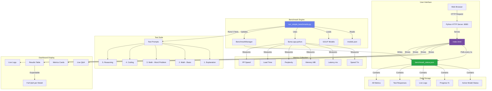
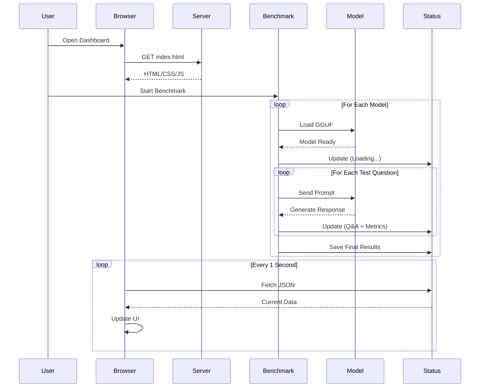

# LLM Benchmark System - Technical Documentation

## Overview

This project benchmarks GGUF-quantized LLM models across multiple dimensions: speed, quality, memory usage, and latency. It features a real-time web dashboard that displays live model responses and comprehensive metrics.

## Quantization Methods Explained

### What is Quantization?

Quantization reduces model size by representing weights with fewer bits, trading some accuracy for significant memory and speed improvements.

### Quantization Types in This Project

#### **Q8_0 (8-bit Quantization)**
- **Precision**: 8 bits per weight
- **Size**: ~50% of original FP16 model
- **Quality**: Minimal quality loss (~1-2%)
- **Speed**: Moderate
- **Use Case**: Best quality-to-size ratio for production
- **Models**: 
  - Llama-3.2-1B-Instruct-Q8_0
  - Llama-3.2-3B-Instruct-Q8_0
  - Meta-Llama-3.1-8B-Instruct-Q8_0

#### **Q6_K (6-bit K-Quant)**
- **Precision**: 6 bits per weight (mixed precision)
- **Size**: ~38% of original
- **Quality**: Slight quality loss (~2-3%)
- **Speed**: Faster than Q8
- **Use Case**: Good balance for resource-constrained environments
- **Models**:
  - Llama-3.2-1B-Instruct-Q6_K
  - Llama-3.2-3B-Instruct-Q6_K
  - Meta-Llama-3.1-8B-Instruct-Q6_K

#### **Q4_K_M (4-bit K-Quant Medium)**
- **Precision**: 4 bits per weight (mixed precision)
- **Size**: ~25% of original
- **Quality**: Noticeable but acceptable quality loss (~5-7%)
- **Speed**: Very fast
- **Use Case**: **Recommended for most users** - best speed/quality balance
- **Models**:
  - Llama-3.2-1B-Instruct-Q4_K_M
  - Llama-3.2-3B-Instruct-Q4_K_M
  - Meta-Llama-3.1-8B-Instruct-Q4_K_M

#### **Q3_K_L / Q3_K_M (3-bit K-Quant)**
- **Precision**: 3 bits per weight (mixed precision)
- **Size**: ~19% of original
- **Quality**: More quality loss (~8-12%)
- **Speed**: Fastest
- **Use Case**: Maximum speed, acceptable for simple tasks
- **Models**:
  - Llama-3.2-1B-Instruct-Q3_K_L
  - Llama-3.2-3B-Instruct-Q3_K_L
  - Meta-Llama-3.1-8B-Instruct-Q3_K_M

### K-Quant Variants

- **K_S (Small)**: Aggressive quantization, smallest size
- **K_M (Medium)**: Balanced approach
- **K_L (Large)**: More bits for important layers

## Model Quantization Pipeline

This diagram shows how the original models were quantized before being tested in this project:

```mermaid
graph LR
    subgraph "Original Models"
        A1[Llama 3.2 1B<br/>FP16 ~2.8GB]
        A2[Llama 3.2 3B<br/>FP16 ~6.5GB]
        A3[Llama 3.1 8B<br/>FP16 ~16GB]
    end
    
    subgraph "Quantization Tools"
        B[llama.cpp<br/>quantize tool]
    end
    
    subgraph "Q8_0 Models"
        C1[1B-Q8_0<br/>~1.4GB]
        C2[3B-Q8_0<br/>~3.3GB]
        C3[8B-Q8_0<br/>~7.3GB]
    end
    
    subgraph "Q6_K Models"
        D1[1B-Q6_K<br/>~1.1GB]
        D2[3B-Q6_K<br/>~2.7GB]
        D3[8B-Q6_K<br/>~5.8GB]
    end
    
    subgraph "Q4_K_M Models"
        E1[1B-Q4_K_M<br/>~770MB]
        E2[3B-Q4_K_M<br/>~2.1GB]
        E3[8B-Q4_K_M<br/>~4.3GB]
    end
    
    subgraph "Q3_K Models"
        F1[1B-Q3_K_L<br/>~700MB]
        F2[3B-Q3_K_L<br/>~1.9GB]
        F3[8B-Q3_K_M<br/>~3.7GB]
    end
    
    A1 -->|8-bit quant| B
    A2 -->|8-bit quant| B
    A3 -->|8-bit quant| B
    B --> C1
    B --> C2
    B --> C3
    
    A1 -->|6-bit K-quant| B
    A2 -->|6-bit K-quant| B
    A3 -->|6-bit K-quant| B
    B --> D1
    B --> D2
    B --> D3
    
    A1 -->|4-bit K-quant| B
    A2 -->|4-bit K-quant| B
    A3 -->|4-bit K-quant| B
    B --> E1
    B --> E2
    B --> E3
    
    A1 -->|3-bit K-quant| B
    A2 -->|3-bit K-quant| B
    A3 -->|3-bit K-quant| B
    B --> F1
    B --> F2
    B --> F3
    
    subgraph "This Benchmark Project"
        G[Tests All 12<br/>Quantized Models]
    end
    
    C1 & C2 & C3 & D1 & D2 & D3 & E1 & E2 & E3 & F1 & F2 & F3 --> G
    
    style A1 fill:#ff6b6b,color:#fff
    style A2 fill:#ff6b6b,color:#fff
    style A3 fill:#ff6b6b,color:#fff
    style B fill:#4ecdc4,color:#fff
    style G fill:#667eea,color:#fff
```



**Key Points:**
- Original models are in FP16 (16-bit floating point)
- Each model is quantized to 4 different precision levels
- Total: 3 model sizes × 4 quantization types = 12 models tested
- Quantization done using llama.cpp's quantize tool
- This project benchmarks the quantized GGUF files

## System Architecture



## Data Flow



## Component Details

### 1. **models.json**
Configuration file defining all models to benchmark:
- Model path
- Parameter count (1B, 3B, 8B)
- Quantization type
- Model family

### 2. **run_simple_benchmarks.py**
Main benchmark script that:
- Loads models sequentially
- Runs 5 different test prompts per model
- Measures 6 key metrics
- Updates status file in real-time
- Handles errors gracefully

### 3. **benchmark_manager.py**
Status file manager that:
- Maintains `benchmark_status.json`
- Provides thread-safe updates
- Logs all events
- Tracks progress

### 4. **index.html**
Real-time dashboard featuring:
- Live Q&A display (all 5 test responses)
- Metrics cards (Speed, Latency, Memory, Load Time)
- Expandable results table
- Auto-refresh every second
- Responsive design

### 5. **benchmark_status.json**
Live status file containing:
- Current active model
- Task description
- Progress percentage
- Event logs
- Complete results with all Q&A responses

## Metrics Explained

### Speed (Tokens/Second)
How fast the model generates text. Higher is better.
- **Excellent**: >100 T/s
- **Good**: 50-100 T/s
- **Acceptable**: <50 T/s

### Latency (Milliseconds)
Time to generate the first token. Lower is better.
- **Excellent**: <50ms
- **Good**: 50-150ms
- **Acceptable**: >150ms

### Memory (MB)
RAM used by the model. Lower is better for deployment.
- **1B models**: 700-1400 MB
- **3B models**: 1900-3300 MB
- **8B models**: 3700-7300 MB

### Load Time (Seconds)
Time to load model into memory. Lower is better.
- Depends on model size and quantization
- Q3/Q4 load faster than Q6/Q8

### Prompt Processing Speed (T/s)
How fast the model processes input tokens.

### Perplexity
Quality metric - how well the model predicts text. Lower is better.
- Calculated on wikitext-2 dataset
- Measures language understanding

## Test Questions

1. **Explanation**: Tests general knowledge and explanation ability
2. **Math - Basic**: Tests arithmetic (15 × 23)
3. **Math - Word Problem**: Tests reasoning and calculation
4. **Coding**: Tests code generation (factorial function)
5. **Reasoning**: Tests logical deduction

## Usage

### Start Web Server
```bash
cd /Users/gaurav/Developer/Code/Benchmark
python3 -m http.server 8080
```

### Run Benchmark
```bash
/opt/anaconda3/bin/python3 run_simple_benchmarks.py
```

### View Dashboard
Open browser to: `http://localhost:8080/index.html`

## Key Findings

Based on benchmark results:

**Best Overall**: Llama-3.2-3B-Instruct-Q4_K_M
- Speed: ~70 T/s
- Memory: ~2GB
- Good quality
- Fast load time

**Fastest**: Llama-3.2-1B-Instruct-Q4_K_M
- Speed: ~150 T/s
- Lowest latency
- Smallest memory footprint

**Best Quality**: Llama-3.2-3B-Instruct-Q8_0
- Highest precision
- Best perplexity scores
- Moderate speed

## Technology Stack

- **Backend**: Python 3.13
- **LLM Runtime**: llama-cpp-python
- **Dataset**: Hugging Face datasets (wikitext-2)
- **Frontend**: Vanilla HTML/CSS/JavaScript
- **Server**: Python http.server
- **Models**: GGUF format (llama.cpp compatible)

## File Structure

```
Benchmark/
├── models.json                 # Model configurations
├── run_simple_benchmarks.py    # Main benchmark script
├── benchmark_manager.py        # Status file manager
├── index.html                  # Real-time dashboard
├── benchmark_status.json       # Live status (generated)
├── benchmark.log               # Execution logs (generated)
├── README.md                   # Quick start guide
└── DOCUMENTATION.md            # This file
```

## Dependencies

```bash
pip install llama-cpp-python datasets psutil
```

## Performance Optimization

1. **Sequential Processing**: Models loaded one at a time to avoid OOM
2. **GPU Acceleration**: Uses Metal (macOS) for inference
3. **Efficient Quantization**: K-quant methods optimize important layers
4. **Real-time Updates**: Minimal overhead status file updates
5. **Responsive UI**: Lightweight polling mechanism

## Future Enhancements

- [ ] Add more test categories (creative writing, translation)
- [ ] Export results to CSV/Excel
- [ ] Compare multiple runs
- [ ] Add model-to-model comparison charts
- [ ] Support for other model formats (GPTQ, AWQ)
- [ ] Batch processing for faster benchmarks
